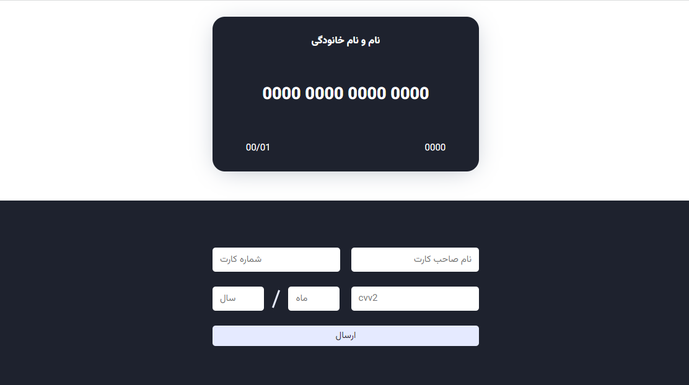

# جزئیات کارت بانکی با تعامل در فرم

تو وب اپلیکیشن ها و وب سایت ها فروشگاهی و یا آموزشی که خرید میزنید (یا هر جایی که لازمه به درگاه بانک وصل بشه) قسمت صفحه پرداخت بانک رو دیده باشید همچنین سیستمی دارند

به شکل خیلی ساده این کار رو انجام دادم

هر فرمی از اطلاعات رو که پر کنید همون بخش از کارت تکمیل میشه

که در اینجا اطلاعات تکمیلی کارت شامل نام دارنده کارت و شماره کارت و cvv2 و تاریخ هست